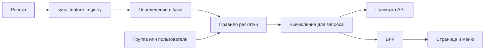

# Фича-флаги: подключение и раскатка

Разработчик объявляет флаг и подключает его к поведению приложения.
Оператор выбирает в админке значение, страницу и аудиторию.

## Выберите сценарий

| Задача | Что настраивается в коде | Что настраивается в админке |
| --- | --- | --- |
| [Включить действие или обычный раздел](feature-flags/code.md#флаг-для-api-и-обычного-раздела) | Boolean-флаг, проверка API, передача значения в UI, маршрут и меню | `true` для [группы](feature-flags/admin.md#включить-для-группы) или [пользователей](feature-flags/admin.md#включить-для-конкретных-пользователей) |
| [Переключить существующую страницу](feature-flags/code.md#переключение-существующей-страницы) | Варианты страницы и выбор по `PageDocument` | `v2` для разрешённой аудитории |
| [Добавить новую продуктовую страницу](feature-flags/code.md#новая-продуктовая-страница) | Реестр, BFF, контракт, контент, frontend-маршрут | Правило для нового флага и контекста страницы |
| [Переключить шапку или подвал](feature-flags/code.md#шапка-и-подвал) | Используются существующие флаги и `Layout` | Отдельное правило для каждого флага |
| Изменить аудиторию готовой функции | Изменения не нужны, если политика разрешает аудиторию | [Создание, проверка и запуск раскатки](feature-flags/admin.md) |

Новый флаг сначала [добавьте в реестр](feature-flags/code.md#объявление-флага),
затем подключите по выбранному сценарию и
[синхронизируйте с базой](feature-flags/code.md#синхронизация-и-проверка).

## Сущности

| Сущность | Назначение |
| --- | --- |
| `FEATURE_REGISTRY` | Ключ, тип, варианты, значение по умолчанию, контексты страниц и политика раскатки |
| `FeatureDefinition` | Определение в базе, к которому привязаны правила; создаётся синхронизацией реестра |
| `FeatureRule` | Значение флага для выбранной аудитории и страницы |
| `FeatureGroup` | Группа пользователей для таргетирования |
| `FeatureOverride` | Исключение, которое применяется раньше правил |
| `ExperimentAssignment` | Сохранённое назначение для sticky-флага |

Группа таргетирования определяет аудиторию флага. Права доступа выдаются
отдельно через Django-группы `auth.Group` и проверки API.

## Как связаны настройки

| Настройка | За что отвечает | Что нужно настроить отдельно |
| --- | --- | --- |
| Запись в реестре | Описывает флаг и допустимую раскатку | Проверки в коде, URL и компоненты |
| Синхронизация | Добавляет определение в базу | Аудиторию и правило |
| Членство в группе | Делает пользователя участником аудитории | Активное правило для этой группы |
| Правило страницы | Выбирает значение в заданном контексте | Передачу того же контекста при вычислении |
| Флаг содержимого страницы | Переключает `legacy` / `v2` | Шапку и подвал, у которых свои флаги |
| Скрытый пункт меню | Убирает ссылку из интерфейса | Проверку прямого открытия маршрута и запросов API |

Если результат отличается от ожидаемого, проверьте
[приоритеты и причины расхождений](feature-flags/admin.md#если-флаг-не-сработал).
