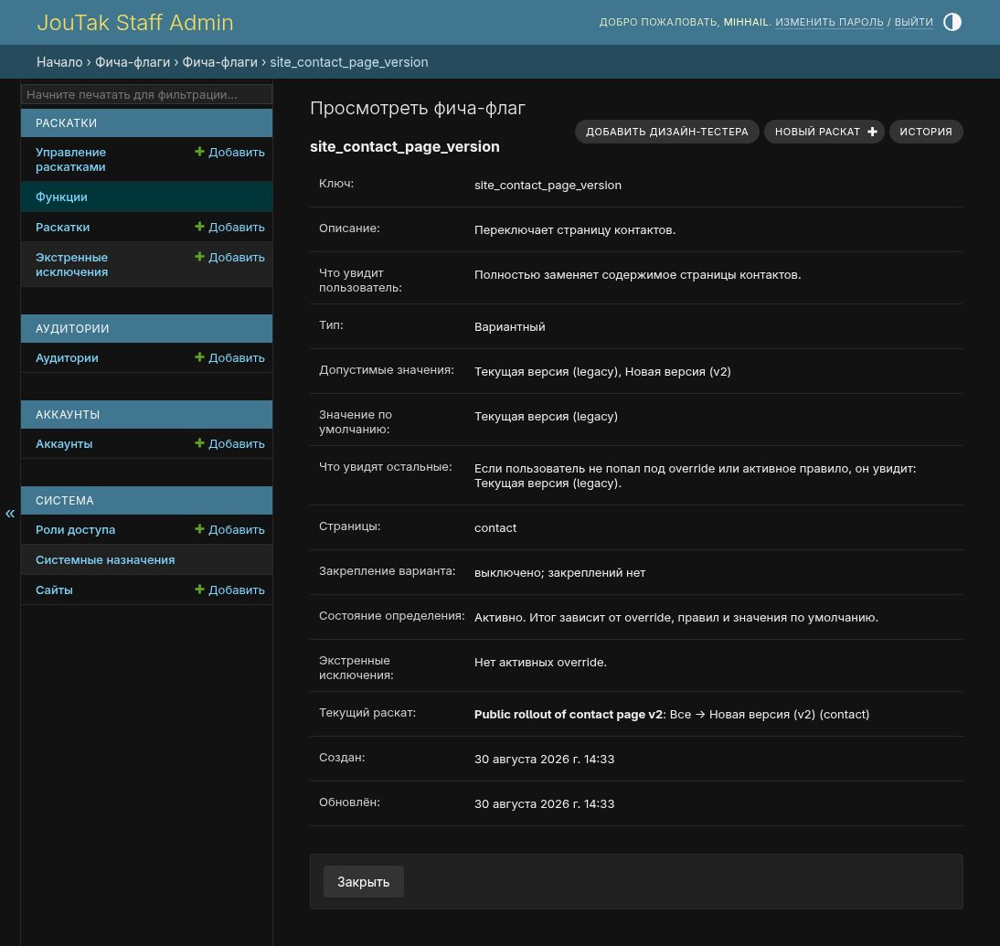
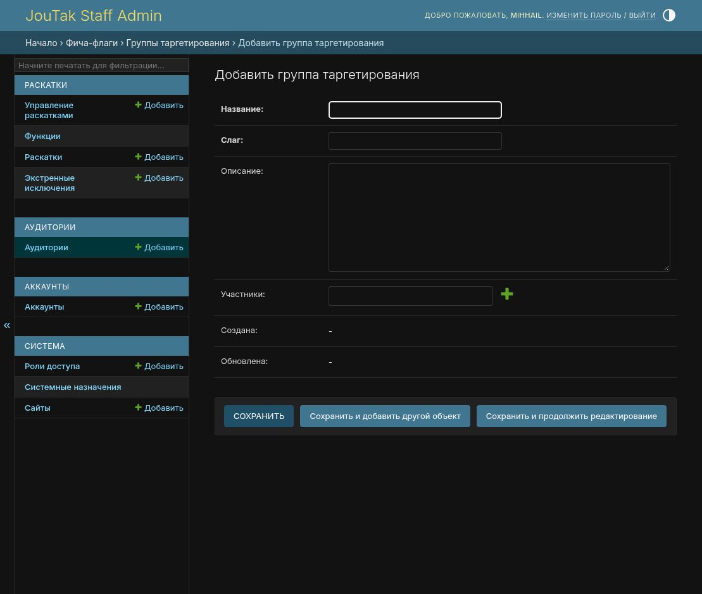
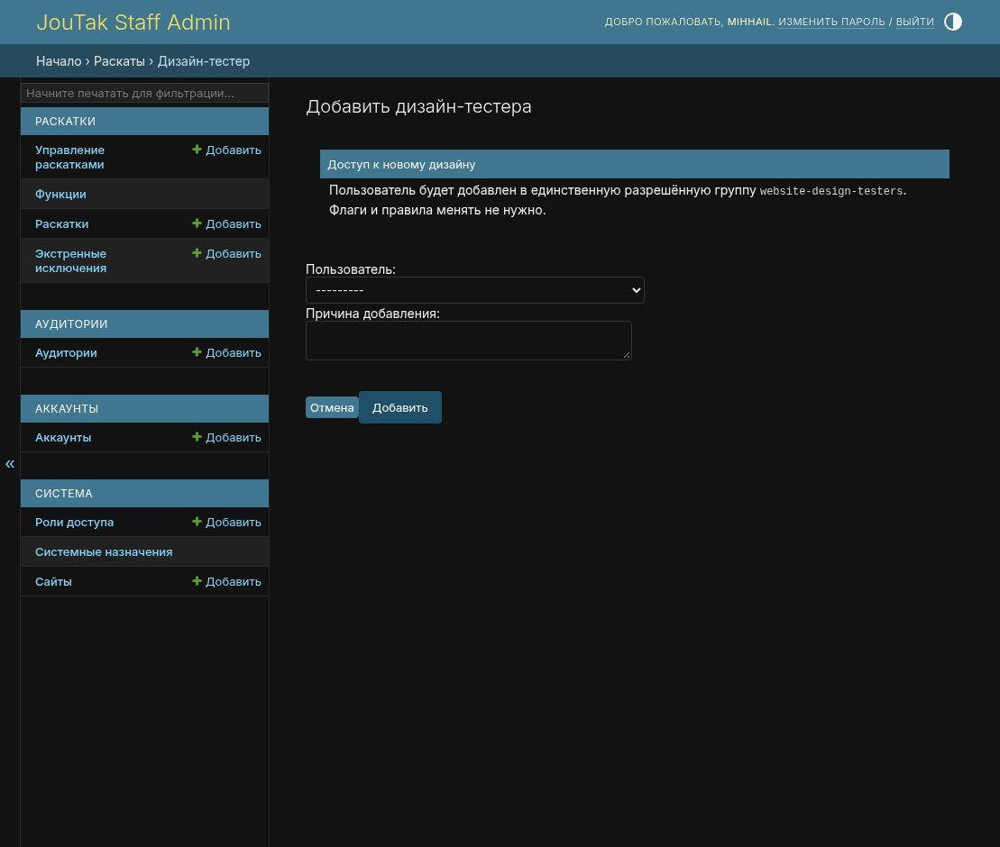
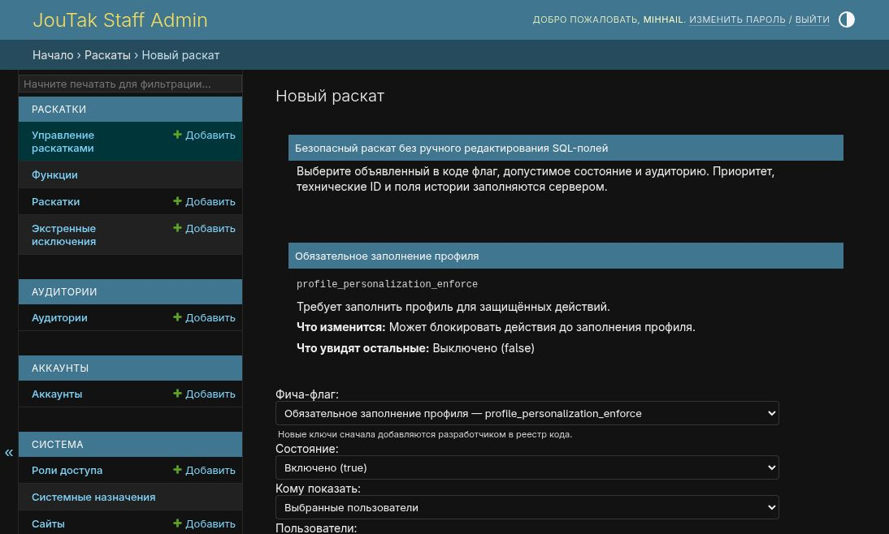
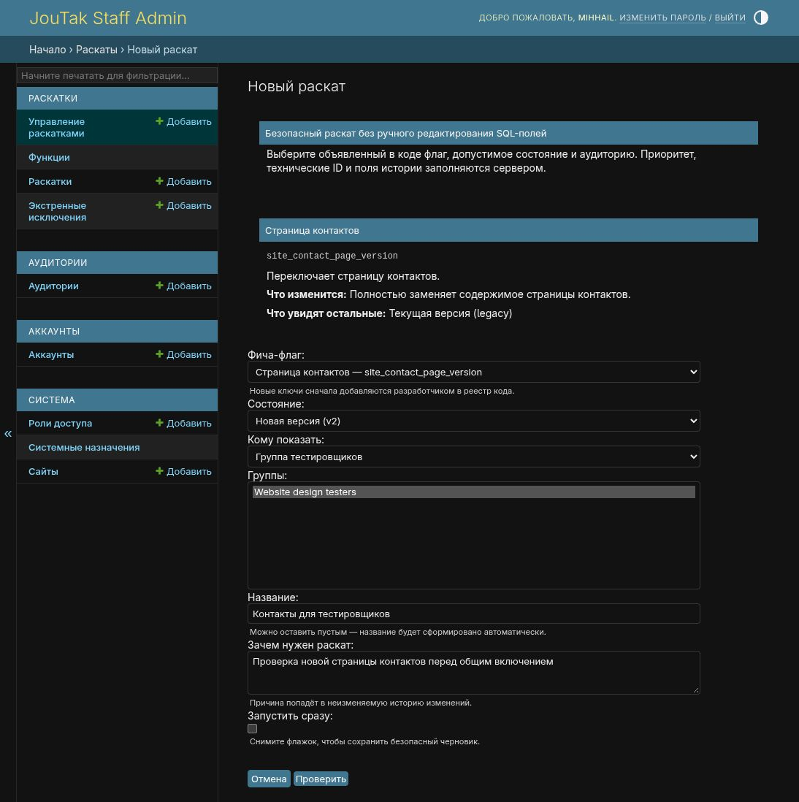
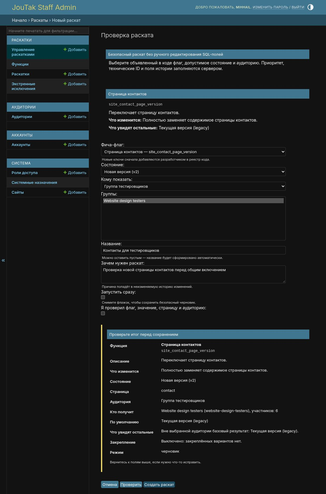
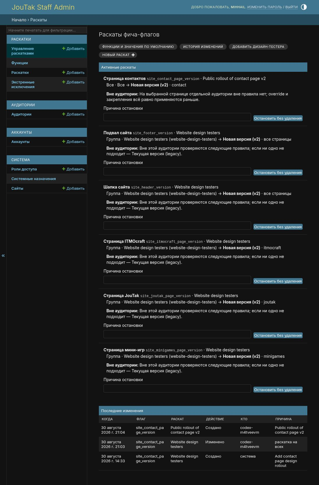

# Настройка раскатки в админке

[Обзор](../feature-flags-rollout.md) · [Подключение флага в коде](code.md)

1. [Выбрать аудиторию](#выбрать-аудиторию)
2. [Включить для группы](#включить-для-группы)
3. [Добавить дизайн-тестера](#добавить-дизайн-тестера)
4. [Включить для пользователей](#включить-для-конкретных-пользователей)
5. [Проверить и запустить](#проверить-и-запустить)
6. [Остановить раскатку](#остановить-раскатку)
7. [Разобраться с результатом](#если-флаг-не-сработал)

Откройте [управление раскатками](https://admin.joutak.ru/admin/featureflags/rollouts/).
В разделе [«Функции»](https://admin.joutak.ru/admin/featureflags/featuredefinition/)
проверьте ключ, значение по умолчанию и описание изменения. Новые ключи
добавляются через [реестр и синхронизацию](code.md#объявление-флага).

## Выбрать аудиторию

В [форме нового раската](https://admin.joutak.ru/admin/featureflags/rollouts/new/)
выберите «Фича-флаг» и «Состояние». Список «Кому показать» зависит от
[политики флага](code.md#политики-раскатки) и прав оператора.

| Аудитория | Кто получит выбранное значение |
| --- | --- |
| Группа тестировщиков | Пользователи, состоящие хотя бы в одной выбранной группе таргетирования |
| Выбранные пользователи | Активные аккаунты из выбранного списка |
| Сотрудники | Пользователи с `is_staff=True` |
| Все авторизованные | Любой вошедший пользователь |
| Процент аудитории | Стабильная доля пользователей и посетителей с анонимным идентификатором |
| Все посетители | Включая гостей |

Для авторизованных, процента и всех посетителей нужно подтвердить широкую
аудиторию. Значение по умолчанию определяет базовое поведение остальных;
также могут применяться [другие правила и исключения](#если-флаг-не-сработал).

Если поле «Страница» показано, выберите контекст функции, например `contact`
или «Все страницы». При единственном варианте форма подставляет его сама.

## Включить для группы

1. Откройте [«Аудитории»](https://admin.joutak.ru/admin/featureflags/featuregroup/).
   Выберите существующую группу или нажмите «Добавить».
2. Задайте название, уникальный слаг и описание. В поле «Участники» найдите
   нужные аккаунты и сохраните группу. Зелёный плюс рядом с полем открывает
   создание аккаунта; существующих пользователей выбирают через поиск в поле.
3. В форме раскатки выберите флаг, состояние и аудиторию «Группа тестировщиков».
   В поле «Группы» выберите сохранённую группу.
4. Перейдите к [проверке и запуску](#проверить-и-запустить).

Членство в группе влияет на все активные правила, которые используют эту
группу. Само создание группы не включает ни одного флага.

## Добавить дизайн-тестера

Для дизайн-флагов используется группа со слагом `website-design-testers`.
Чтобы добавить человека, откройте
[«Добавить дизайн-тестера»](https://admin.joutak.ru/admin/featureflags/design-testers/add/),
выберите аккаунт, укажите причину и подтвердите добавление.

Если правило для нужного флага уже активно, создавать ещё одно не требуется.
Пользователь попадёт во все активные раскатки этой группы, включая шапку и
подвал. Для выхода из аудитории удалите его из состава группы в «Аудиториях».

## Включить для конкретных пользователей

1. Откройте новый раскат и выберите boolean-флаг, например
   `profile_personalization_enforce`.
2. Выберите «Включено (true)» и «Выбранные пользователи».
3. В поле «Пользователи» отметьте нужные активные аккаунты. Для выбора
   нескольких строк используйте `Ctrl` или `Cmd`.
4. Укажите страницу и перейдите к [проверке и запуску](#проверить-и-запустить).

Отдельная группа для этого сценария не нужна. Если «Выбранные пользователи»
отсутствуют, проверьте политику флага и право `auth.view_user`. Для дизайн-флага
используйте [добавление дизайн-тестера](#добавить-дизайн-тестера).

## Проверить и запустить

1. Заполните «Зачем нужен раскат» конкретной причиной длиной от 5 до 100 символов.
   Название можно оставить пустым, форма создаст его автоматически.
2. Снимите «Запустить сразу», если хотите сохранить черновик. С установленным
   флажком правило начнёт действовать после создания.
3. Нажмите «Проверить». Сверьте флаг, состояние, страницу, аудиторию,
   поведение остальных пользователей и режим запуска.
4. Отметьте «Я проверил флаг, значение, страницу и аудиторию» и нажмите
   «Создать раскат».

Кнопка «Проверить» только проверяет форму. Сохранение происходит по кнопке
«Создать раскат». Для черновика затем потребуется отдельный запуск из списка.

Если форма сообщает о конфликте, найдите активное правило того же флага на
этой странице. Правило «Все страницы» тоже считается пересекающимся. Для
смены аудитории остановите прежнее правило с причиной и создайте новое.

После запуска перезагрузите страницу под аккаунтом из аудитории и под
аккаунтом вне неё. Для публичной раскатки проверьте гостя. При проверке дизайна
используйте обычного пользователя без staff preview.

## Остановить раскатку

В [управлении раскатками](https://admin.joutak.ru/admin/featureflags/rollouts/)
найдите правило, заполните «Причина остановки» и нажмите
«Остановить без удаления». Правило перестанет участвовать в вычислении,
история сохранится.

После остановки результат определяется оставшимися правилами, исключениями
и default. У sticky-флага может сохраниться прежнее назначение. Для повторного
включения остановленной раскатки создайте новое правило: кнопка запуска
предназначена для черновиков, которые ещё не запускались.

## Если флаг не сработал

[Движок](../../backend/featureflags/services.py) проверяет назначения в таком порядке:

1. Подписанный staff preview, если политика его разрешает.
2. Переопределение из базы: пользователь, анонимный посетитель, затем глобальное.
3. Сохранённое sticky-назначение.
4. Первое подходящее активное правило. Меньший `priority` проверяется раньше;
   при равенстве первым идёт меньший `id`.
5. Значение по умолчанию с учётом политики флага.

Ограничения защищённых вариантов действуют и при этом порядке вычисления.

| Симптом | Что проверить |
| --- | --- |
| Флага нет в форме | Запись в реестре развёрнутой версии, синхронизацию и `active` определения |
| Участник группы не видит функцию | Вход в нужный аккаунт, состав группы, активность правила, совпадение контекста страницы |
| API и UI получают разные значения | Один ли пользователь и `context.page`; одинаковы ли условия вычисления, включая preview и анонимный идентификатор |
| `/itmocraft` всегда показывает старую страницу | Это фиксированный legacy-маршрут; раскатку главной смотрите на `/` |
| Страница стала новой, шапка осталась старой | У шапки и подвала отдельные флаги и правила |
| После остановки функция остаётся включена | Preview, исключения, sticky, другие правила, default; затем перезагрузку UI |
| Нет кнопки или аудитории | Права оператора и политику флага |

[«Раскатки»](https://admin.joutak.ru/admin/featureflags/featurerule/) открывают
расширенные поля правила, включая приоритет.
[«Экстренные исключения»](https://admin.joutak.ru/admin/featureflags/featureoverride/)
позволяют переопределить значение для пользователя, анонимного ID или всех.
Для обычного персонального включения используйте аудиторию «Выбранные
пользователи»: она проходит проверку и сохраняет историю раскатки.
[«Системные назначения»](https://admin.joutak.ru/admin/featureflags/experimentassignment/)
показывают sticky-значения; вручную создавать их не нужно.

Отсутствующее или неактивное определение возвращает default из реестра.
Снятие `active` не равнозначно выключению boolean-флага.

### Права оператора

Для входа в админку нужен staff-доступ. Права на действия настраиваются
в [ролях доступа](https://admin.joutak.ru/admin/auth/group/).

| Действие | Права |
| --- | --- |
| Открыть управление раскатками | `featureflags.view_featuredefinition` и одно из `view_featurerule` / `change_featurerule` |
| Создать раскатку | Права на просмотр консоли, `featureflags.add_featurerule`, `featureflags.view_featuregroup` |
| Выбрать пользователей | Дополнительно `auth.view_user` |
| Выбрать широкую аудиторию | Дополнительно `featureflags.change_featuredefinition` |
| Запустить черновик или остановить правило | `featureflags.change_featurerule`, доступ к консоли и права на соответствующую аудиторию при запуске |
| Добавить дизайн-тестера | `featureflags.change_featuregroup` и `auth.view_user` |
| Редактировать группы в «Аудиториях» | `featureflags.view_featuregroup`, `change_featuregroup`, `delete_featuregroup` и `auth.view_user`; для создания также `add_featuregroup` |

Карточка определения доступна только для чтения. Право
`change_featuredefinition` разрешает широкую раскатку, но не открывает
редактирование самой карточки.
