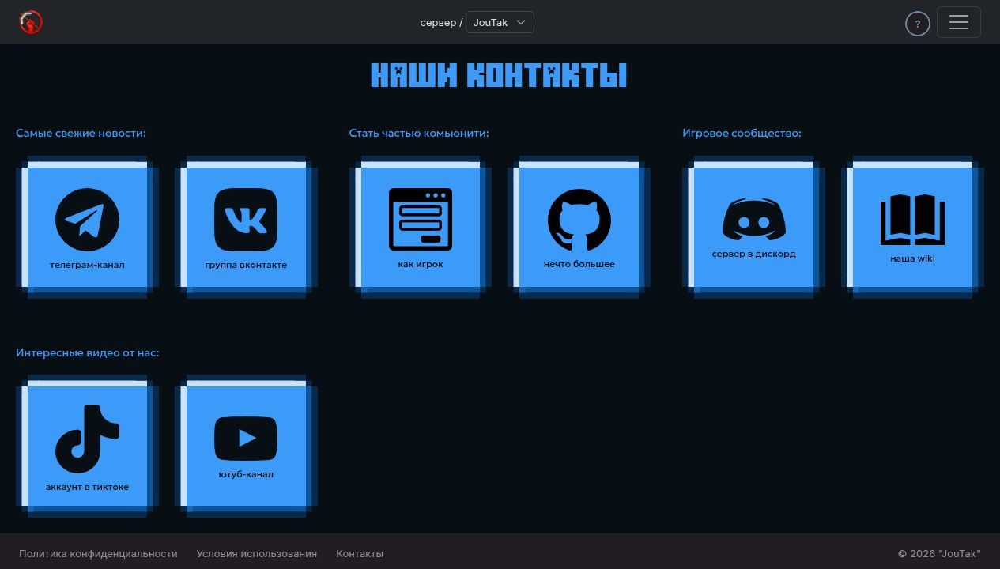

# Подключение флага в коде

[Обзор](../feature-flags-rollout.md) · [Настройка раскатки](admin.md)

1. [Объявление флага](#объявление-флага)
2. [API и обычный раздел](#флаг-для-api-и-обычного-раздела)
3. [Существующая страница](#переключение-существующей-страницы)
4. [Новая продуктовая страница](#новая-продуктовая-страница)
5. [Шапка и подвал](#шапка-и-подвал)
6. [Синхронизация и проверка](#синхронизация-и-проверка)

## Объявление флага

Добавьте запись в `FEATURE_REGISTRY` в
[реестре](../../backend/featureflags/registry.py), до вычисления `DESIGN_FLAG_KEYS`.
Пример boolean-флага для нового каталога:

```python
"catalog_preview_ui": {
    "title": "Предпросмотр каталога",
    "kind": "boolean",
    "default_env": None,
    "default_fallback": False,
    "variants": (True, False),
    "pages": ["*"],
    "sticky": False,
    "description": "Открывает каталог выбранной аудитории.",
    "visual_impact": "Показывает страницу каталога и пункт меню.",
    "rollout_policy": BOOLEAN_ROLLOUT_POLICY,
},
```

| Поле | Назначение |
| --- | --- |
| Ключ словаря | Идентификатор, общий для backend, frontend и правил |
| `title` | Название в админке |
| `kind`, `variants` | Тип (`boolean` или `variant`) и допустимые значения |
| `default_fallback` | Значение без активного определения в базе; для новой функции обычно `False` или `legacy` |
| `default_env` | Имя Django-настройки, которая заменяет исходное значение по умолчанию; `None` отключает эту возможность |
| `pages` | Контексты вычисления, например `account`, `contact` или `*` |
| `sticky` | Сохранять ли назначенный вариант между запросами |
| `description` | Поведение, которым управляет флаг |
| `visual_impact` | Изменение, которое увидит пользователь |
| `rollout_policy` | Разрешённые аудитории и ограничения значений |

Для `default_env` нужна настройка в Django settings: одной строки в `.env`
недостаточно. Для обычного включения функции оставляйте `sticky=False`, чтобы
сохранённое назначение не мешало остановить раскатку.

### Политики раскатки

| Политика | Доступные аудитории | Ограничения |
| --- | --- | --- |
| `BOOLEAN_ROLLOUT_POLICY` | Группа, пользователи, сотрудники, авторизованные, процент, все | Значения `True` и `False` |
| `DESIGN_ROLLOUT_POLICY` | Группа `website-design-testers` | Защищённый вариант `v2`, безопасный `legacy`, без публичной раскатки и sticky |
| `CONTACT_PAGE_ROLLOUT_POLICY` | Группа `website-design-testers` или все посетители | Разрешает публичную раскатку контактов; sticky выключен |

Защита дизайна нужна, чтобы обновление приложения или случайная смена default
не открыли новую версию всем посетителям. Движок разрешает `v2` только через
допустимое правило или staff preview. Обычное переопределение в базе не обходит
эту проверку. `safe_default="legacy"` задаёт результат без подходящего правила.

Для персонального списка у нового boolean-флага подходит
`BOOLEAN_ROLLOUT_POLICY`. У дизайн-флагов аудитория «Выбранные пользователи»
недоступна: используйте [группу дизайн-тестеров](admin.md#добавить-дизайн-тестера).
Новую политику объявляйте рядом с существующими и проверяйте через
`validate_registry()`; `user_allowlist` обозначает персональный список,
`everyone` требует `allow_public=True`.

### Контекст страницы

`pages=["contact"]` обозначает `RequestEvaluationContext.page == "contact"`.
Для URL `/contact` используется контекст `contact`, без начального слеша.

| Место вычисления | Как выбираются флаги |
| --- | --- |
| `GET /bff/bootstrap` | `pages` содержит `bootstrap` или `*` |
| `GET /bff/account/summary` | `pages` содержит `account` или `*`; требуется вход |
| `PageDocument` | Явно запрашиваются флаг продукта, шапки и подвала |
| `evaluate_many(context, keys)` | Вычисляются переданные ключи; `pages` не фильтрует этот список |

В правиле «Все страницы» хранится как `page=""`. Непустая страница правила
должна совпадать с `context.page`. Используйте одинаковый контекст в API и UI:
процентное распределение зависит и от пользователя, и от страницы.

## Флаг для API и обычного раздела

### Проверка API

После [добавления в реестр](#объявление-флага) проверяйте флаг в сервисе,
который вызывают затронутые endpoint. Пример для авторизованного пользователя:

```python
from accounts.api.errors import raise_structured_error
from featureflags.services import RequestEvaluationContext, evaluate_many


def require_catalog_preview(user):
    context = RequestEvaluationContext(user=user, page="bootstrap")
    flags = evaluate_many(context, ["catalog_preview_ui"])
    if flags["catalog_preview_ui"] is not True:
        raise_structured_error(
            404,
            detail="Функция недоступна",
            error_code="FEATURE_DISABLED",
        )
```

Здесь `bootstrap` совпадает с контекстом загрузки флага для UI ниже.
Перед вызовом проверьте сессию и права на действие. В
[account router](../../backend/accounts/api/router.py) для этого используются
`x_session_token_auth`, `_require_authenticated_user()` и
`SessionService.assert_session_allowed()`.

Для нового Ninja-роутера задайте `Router(auth=[x_session_token_auth])`,
импортируйте его в [таблицу URL](../../backend/backend/urls.py) и подключите
через `api.add_router("/catalog", catalog_router)`. URL регистрируется при
запуске приложения; флаг проверяется в каждом запросе. Добавьте `404: ErrorOut`
в response map endpoint, который может вернуть `FEATURE_DISABLED`.

Вызовите проверку во всех операциях, закрываемых флагом, включая прямое чтение
карточки и запись. Пример существующей серверной проверки с вычислением флагов:
[AccountStatusService](../../backend/accounts/services/account_status.py).

Если нужны анонимная процентная раскатка или staff preview, используйте
`build_context(request, page=..., response=response)`, как в
[BFF views](../../backend/bff/views.py). Передавайте тот response, который
вернётся клиенту: в него записывается cookie анонимного идентификатора.

### Передача значения в UI и маршрут

Для `catalog_preview_ui` с `pages=["*"]` endpoint `GET /bff/bootstrap`
возвращает `features.catalog_preview_ui`. Добавьте его загрузку в слой данных
нового раздела по образцу [pageApi](../../frontend/src/services/api/pageApi.js):

```javascript
import { requestWithSession } from "../auth/sessionClient";
import { rootClient } from "../http/client";

export async function getBootstrap({ signal } = {}) {
  const response = await requestWithSession("get", "/bff/bootstrap", {
    client: rootClient,
    hardLogoutOn401: false,
    signal,
  });
  return response.data;
}
```

`rootClient` обращается к корню backend: BFF находится под `/bff`, без `/api`.
Общий провайдер bootstrap-флагов в приложении не подключён. Для нового раздела
нужно добавить загрузку и хранение результата, обработку ожидания и ошибки.

1. Передайте `features` из ответа в страницу и меню. Показывайте новую функцию
   только при `features.catalog_preview_ui === true`.
2. Добавьте компонент страницы и `<Route>` в
   [App.jsx](../../frontend/src/App.jsx). Проверяйте значение внутри компонента
   маршрута, чтобы прямое открытие URL тоже учитывало флаг.
3. До загрузки показывайте индикатор; при ошибке или выключенном флаге не
   рендерите закрытую страницу. Скрывайте её пункт в
   [DynamicMenu](../../frontend/src/components/DynamicMenu.jsx).
4. После входа, выхода и смены аккаунта сбрасывайте прежние значения и заново
   загружайте решение. Обработку `AUTH_STATE_EVENT` и отмену устаревшего запроса
   можно взять из
   [PageDocumentProvider](../../frontend/src/features/pageDocument/PageDocumentProvider.jsx).

Затем [синхронизируйте флаг](#синхронизация-и-проверка) и создайте правило
«Все страницы» для [группы](admin.md#включить-для-группы) или
[конкретных пользователей](admin.md#включить-для-конкретных-пользователей).

## Переключение существующей страницы

Для продуктовых страниц BFF вычисляет вариант и возвращает `PageDocument`.
Frontend выбирает компонент по `effective_page_variant`.

| URL | BFF endpoint | Контекст | Флаг |
| --- | --- | --- | --- |
| `/` | `/bff/pages/itmocraft` | `itmocraft` | `site_itmocraft_page_version` |
| `/itmocraft` | `/bff/pages/itmocraft/legacy` | `itmocraft` | Всегда `legacy` |
| `/joutak` | `/bff/pages/joutak` | `joutak` | `site_joutak_page_version` |
| `/minigames` | `/bff/pages/minigames` | `minigames` | `site_minigames_page_version` |
| `/contact` | `/bff/pages/contact` | `contact` | `site_contact_page_version` |

Связи URL и BFF заданы в [pageRegistry](../../frontend/src/routing/pageRegistry.js),
а флаг продукта выбирается в [PRODUCTS](../../backend/bff/services.py).
`/itmocraft` сохраняет старую страницу даже при включённом `v2`; новую версию
главной проверяйте на `/`.

1. Подготовьте старый и новый компоненты. Если страница использует контент BFF,
   обновите её запись в [PRODUCT_CONTENT](../../backend/bff/content/__init__.py).
2. Получите `document` и `loading` через `usePageDocument()`.
3. Во время первой загрузки показывайте `PageLoading`. При
   `document?.effective_page_variant === "v2"` возвращайте новый компонент,
   иначе старый. Так устроена [страница контактов](../../frontend/src/pages/Contact/Contact.jsx).
4. В админке выберите флаг страницы, `v2` и
   [разрешённую аудиторию](admin.md#выбрать-аудиторию).

Если оба варианта уже подключены, для изменения раскатки достаточно шага 4.



## Новая продуктовая страница

Для страницы `/catalog` добавьте всю цепочку, используя одну строку `catalog`
как `product_id` и контекст страницы.

| Шаг | Где изменить | Что добавить |
| --- | --- | --- |
| 1 | [Реестр](../../backend/featureflags/registry.py) | `site_catalog_page_version`: `kind="variant"`, варианты `VERSIONS_VARIANTS`, default `legacy`, `pages=["catalog"]`, `sticky=False`, названия и описания, `DESIGN_ROLLOUT_POLICY` |
| 2 | [PRODUCTS](../../backend/bff/services.py) | `catalog` с `canonical_path="/catalog"`, `page_flag="site_catalog_page_version"` и допустимым `default_project` |
| 3 | [Контент](../../backend/bff/content/__init__.py) | Модуль `catalog.py` с вариантами `legacy` и `v2`, импорт и запись в `PRODUCT_CONTENT` |
| 4 | [Контракт](../../backend/bff/schemas.py) | `catalog` в `ProductInfo.id`; новые виды секций или `default_project`, если они нужны странице |
| 5 | [BFF view](../../backend/bff/views.py) и [URL](../../backend/bff/urls.py) | View по образцу `joutak`: `page="catalog"`, `product_id="catalog"`, `requested_path="/catalog"`; маршрут `pages/catalog` |
| 6 | [pageRegistry](../../frontend/src/routing/pageRegistry.js) | `/catalog` с `productId: "catalog"` и `endpoint: "/bff/pages/catalog"` |
| 7 | [App.jsx](../../frontend/src/App.jsx) | Компоненты вариантов, компонент маршрута с `usePageDocument()`, импорт и `<Route path="/catalog" ... />` внутри `Layout` |
| 8 | [Меню](../../frontend/src/components/DynamicMenu.jsx) | Ссылка на страницу; для нового `default_project` также обновите [настройки проектов](../../frontend/src/utils/projectUtils.js) |

После изменения схемы сгенерируйте JSON-контракт из корня репозитория:

```bash
PYTHONPATH=backend uv run python -m bff.generate_contracts
```

Включите [page-document.schema.json](../../contracts/page-document.schema.json)
в тот же коммит. `PageDocumentProvider` уже подключён в
[main.jsx](../../frontend/src/main.jsx), а его валидатор использует эту схему.

Затем выполните [синхронизацию и проверки](#синхронизация-и-проверка), создайте
правило `site_catalog_page_version = v2` для страницы `catalog` и
[дизайн-тестеров](admin.md#добавить-дизайн-тестера). Остальным должна открываться
реализованная версия `legacy`. Если требуется полностью закрыть новый раздел,
используйте [boolean-флаг с проверкой API и маршрута](#флаг-для-api-и-обычного-раздела).

## Шапка и подвал

`site_header_version` и `site_footer_version` вычисляются отдельно от флага
страницы. [Layout](../../frontend/src/components/Layout.jsx) читает
`document.layout.header_variant` и `footer_variant`.

Для включения создайте отдельное групповое правило `v2` на каждый нужный флаг.
Вариант страницы при этом не меняется. На маршрутах без `PageDocument`
`Layout` использует `legacy`.

## Синхронизация и проверка

Запустите команды в окружении нужной базы, после применения миграций:

```bash
uv run python backend/manage.py sync_feature_registry --dry-run
uv run python backend/manage.py sync_feature_registry
```

При ручном запуске проверьте `DJANGO_SETTINGS_MODULE` и `DATABASE_URL`.
Без заданного модуля настроек `manage.py` использует `backend.settings.dev`.

Команда проверяет реестр и создаёт определения. При повторном запуске она
обновляет метаданные, сохраняя существующие `default_value` и `active`.
`--force-defaults` перезаписывает default у всех зарегистрированных флагов,
поэтому для обычного добавления флага он не нужен. При запуске backend
[entrypoint](../../backend/docker-entrypoint.sh) выполняет синхронизацию после
миграций. Группы и правила создаются отдельно.

Проверьте [карточку функции](https://admin.joutak.ru/admin/featureflags/featuredefinition/),
затем переходите к [настройке раскатки](admin.md).

Для изменений кода добавьте проверки подходящей и неподходящей аудитории,
выключенного флага, прямого запроса API и смены пользователя. Для продуктовой
страницы проверьте оба варианта и независимое переключение шапки и подвала.
Тесты можно взять за основу в [featureflags](../../backend/featureflags/tests/),
[BFF](../../backend/bff/tests/test_views.py) и
[PageDocumentProvider](../../frontend/src/features/pageDocument/__tests__/PageDocumentProvider.test.jsx).

```bash
uv run pytest backend/featureflags backend/bff -q
npm --prefix frontend run test:run
npm --prefix frontend run build
```
