# Завершение нового дизайна JouTakWeb

## Продуктовая точка отсчёта

- `joutak.ru/` — каноническая главная ITMOcraft: сообщество, проекты, события,
  галерея и FAQ.
- `/joutak` — отдельная поверхность сервера JouTak: позиционирование, IP,
  заявка, оплата и галерея.
- `/minigames` — режимы, события и игровые материалы MiniGames.
- `/itmocraft` — совместимый старый адрес ITMOcraft. Канонической точкой входа
  остаётся `/`; alias сохраняет знакомый контент и не превращается в страницу
  сервера JouTak.

## Текущее состояние V2 после этой ветки

- Header, hero, gallery, event cards и footer больше не создают горизонтальный
  overflow на desktop; добавлены отдельные tablet/mobile layouts.
- Header и footer ведут в ITMOcraft через канонический `/`.
- Calendar, News, Modex, Team и Documents показаны как честные состояния
  `disabled / скоро`, пока у них нет маршрута и законченного сценария.
- Dropdown серверов использует `menu/menuitem`, скрыт из accessibility tree в
  закрытом состоянии и явно помечает недоступный Modex.
- JouTak hero снова показывает IP, заявку и оплату проходки.
- ITMOcraft, JouTak и MiniGames получили единый блок продуктовых действий в
  V2: заявка организатора; IP, регистрация и оплата JouTak; IP, чат,
  регистрация, правила и партнёр MiniGames. Эти сценарии больше не исчезают
  при переключении флага.
- Галерея игнорирует `#` и пустые photo sources, показывает собственные
  empty/error states, отключает бессмысленные стрелки при `0–1` фото и
  использует локальные материалы JouTak/MiniGames.
- Event CTA без реальной ссылки становится disabled, а не меняет URL на `#`.
- ITMOcraft CTA ведёт в существующую форму организаторов.
- Light/dark theme переключает реальную Gravity UI theme, сохраняется между
  загрузками и имеет русское accessible name.
- Исправлено подключение CSS-модуля ITMOcraft CTA и отсутствовавшего шрифта
  event cards.
- Auth, account, onboarding, contact, payment, confirmation/reset, session
  expired, loading и 404 теперь используют единый responsive V2 shell вместо
  смеси Bootstrap и разрозненных inline-карточек.
- Прямой `/login` получил собственный фон и безопасное закрытие на `/`, не
  выбрасывающее пользователя назад за пределы сайта; переходы через `next`
  сохраняются только для внутренних адресов.
- Платёжный экран объясняет модель взноса до формы, показывает loading state,
  даёт внешний fallback и не позволяет iframe автоматически прокрутить
  пользователя мимо вводного блока.
- Контакты представлены как самостоятельные понятные destinations с описанием
  назначения Telegram, VK и Discord, а не как ряд не подписанных иконок.
- Видимые legal links больше не заканчиваются общим 404. До передачи
  утверждённых текстов они открывают честный экран «документ готовится» с
  возвратом на главную и в контакты.
- Авторизация публикует authenticated-состояние только после одного успешного
  обмена session token на JWT. Дублирующий bootstrap удалён: локальный SQLite
  больше не получает конкурирующие запросы во время входа.
- Галерея переходит в линейную адаптивную компоновку до того, как фиксированный
  desktop-макет начинает выходить за viewport. Отсутствующий дизайнерский ассет
  теперь показывается как управляемый placeholder, а не как broken image.

## Проверенные экраны

Все скриншоты сняты локально на `1280×720` с тестовыми аккаунтами: один получает
fail-closed `legacy`, второй входит в `website-design-testers` и получает V2.
В кадрах нет production-данных.

### Продуктовые поверхности

#### Флаг выключен

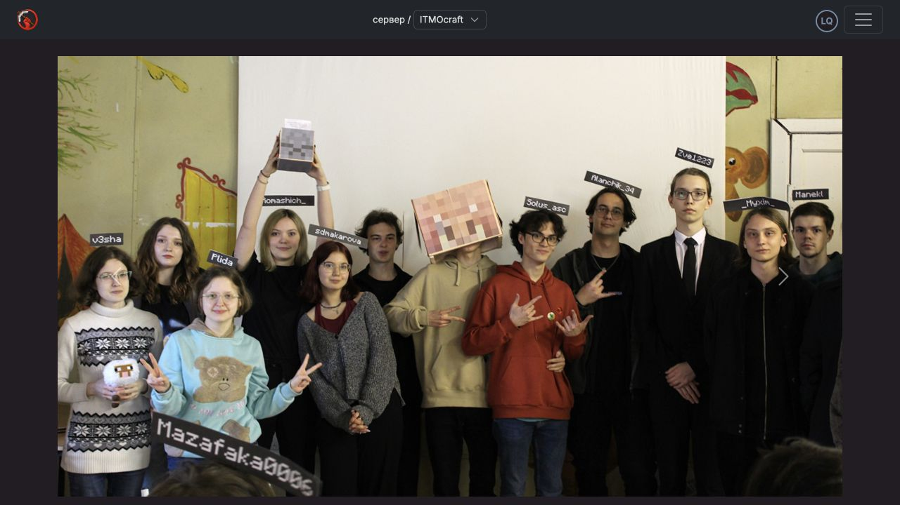

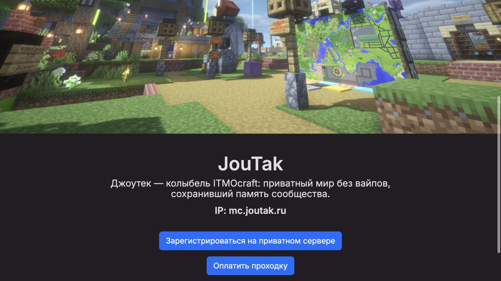

#### Флаг включён

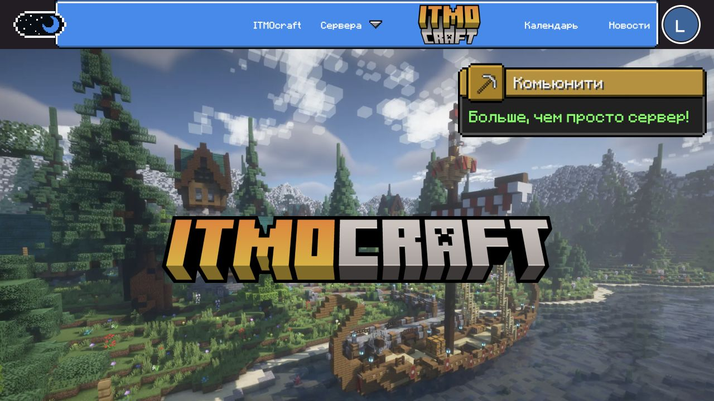

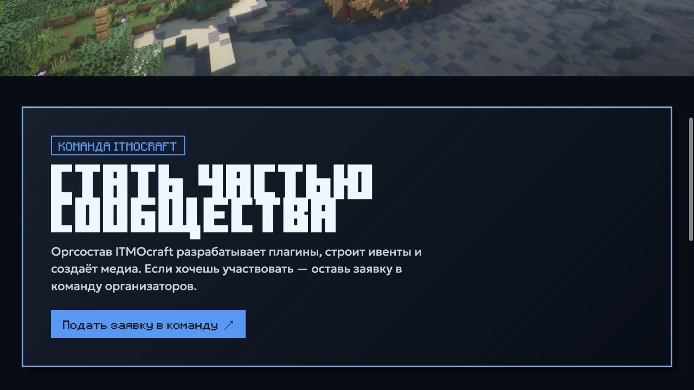

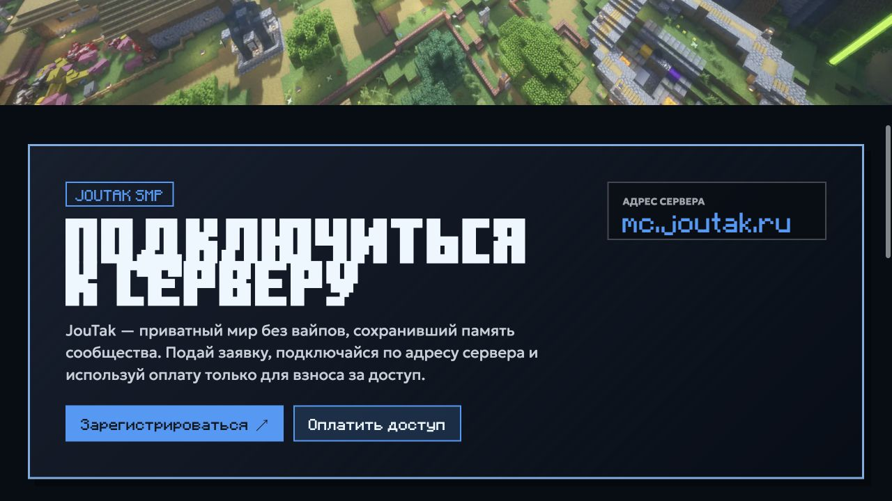

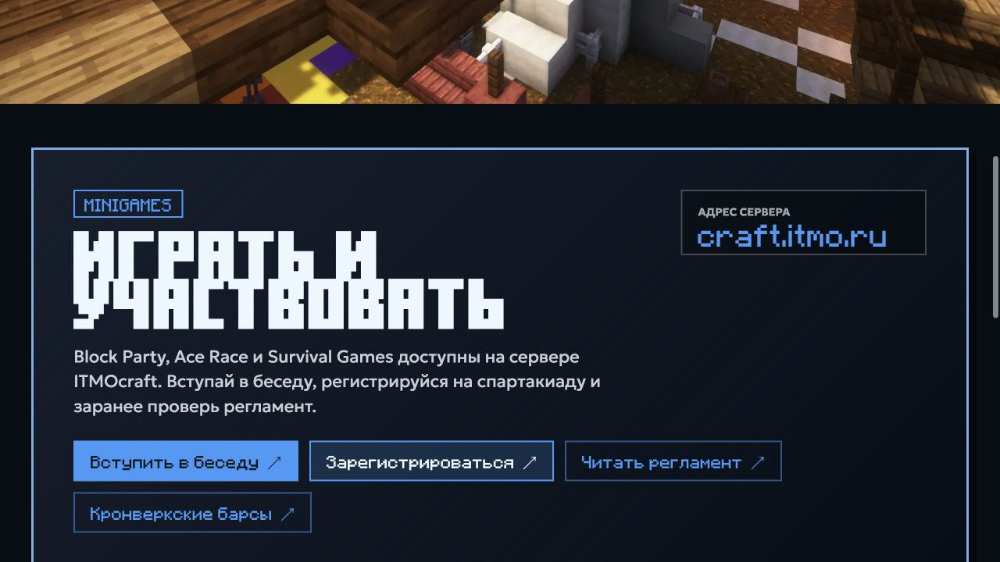

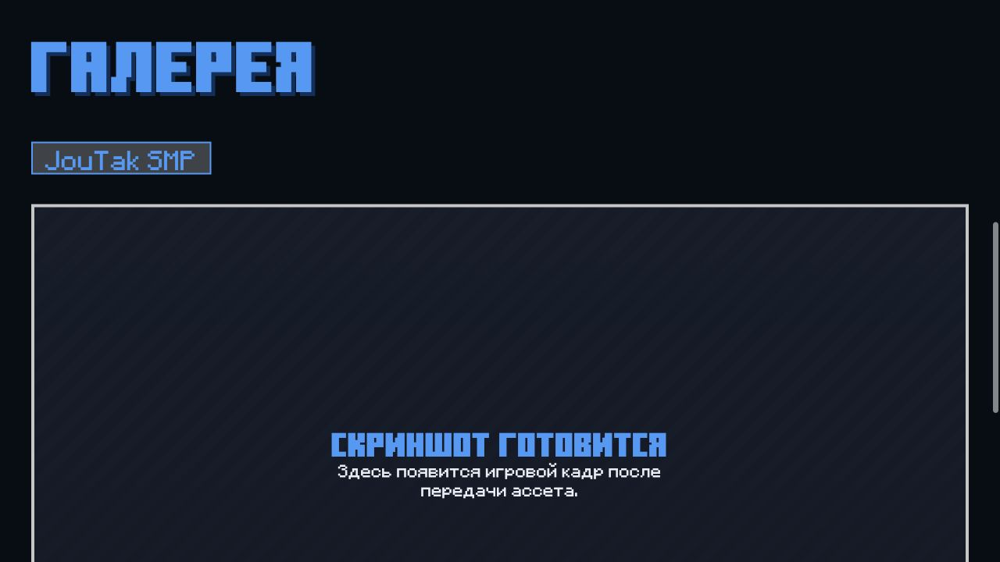

### Авторизация и аккаунт

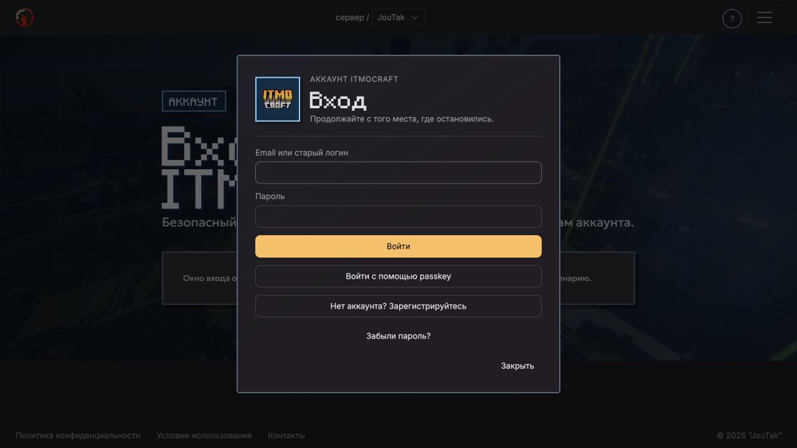

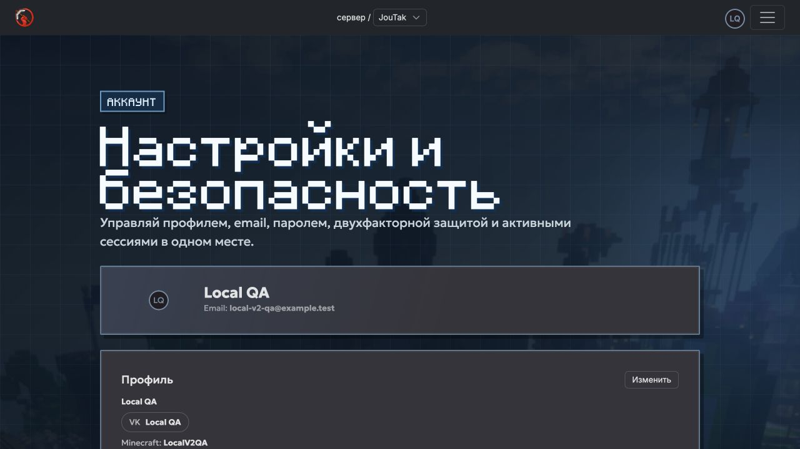

### Системные сценарии

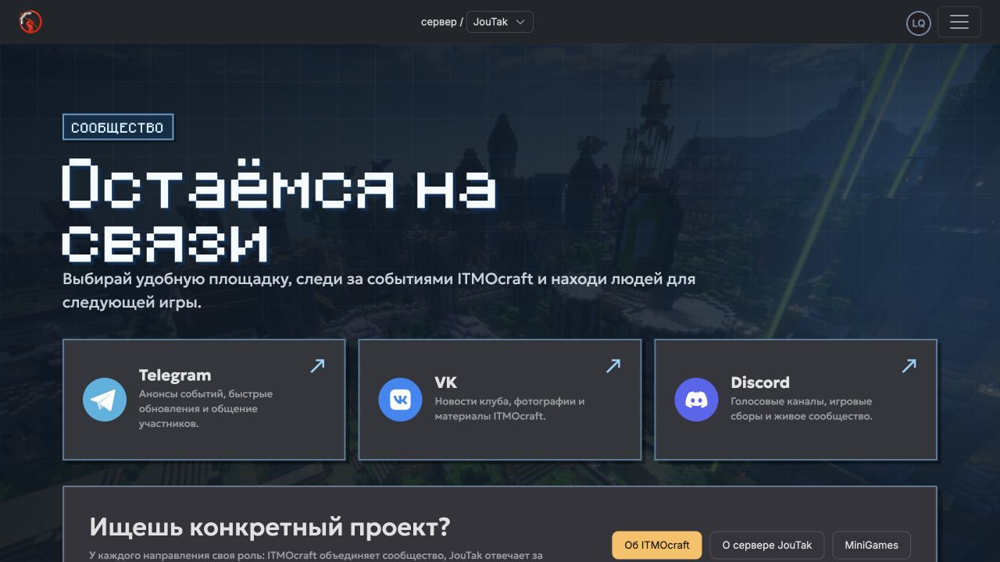

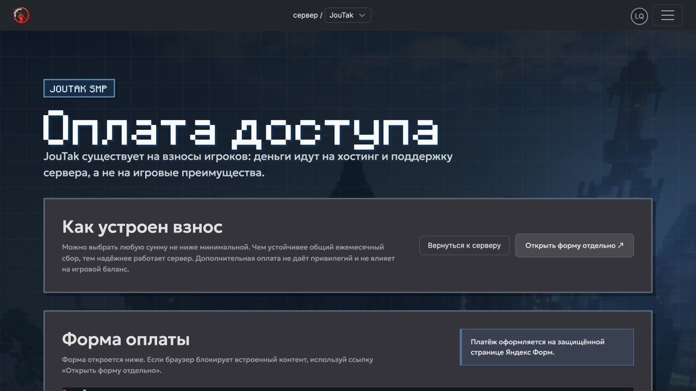

## Наблюдения локального прогона

- Два реальных браузерных сеанса прошли `/`, `/itmocraft`, `/joutak`,
  `/minigames`, `/contact`, `/joutak/pay`, `/account/security`,
  `/session-expired`, `/reset-password` и 404. На `1280×720` в обоих вариантах
  нет horizontal scroll и broken images.
- Автоматическая responsive-матрица дополнительно проверяет `/`, `/itmocraft`,
  `/joutak` и `/minigames` в режимах `legacy` и `v2` на ширинах `320`, `375`,
  `480`, `768`, `1024`, `1440`. Она также фиксирует конкретные элементы,
  выходящие за viewport.
- V2 выдаётся только после локальной авторизации пользователем из
  `website-design-testers`; без правила остаётся fail-closed `legacy`. Сессия и
  account-состояние сохраняются при переходах между продуктовой и системной
  поверхностями.
- Вход выполняет один JWT exchange, затем получает профиль и только после
  этого уведомляет layout/BFF об authenticated-состоянии. В живом прогоне нет
  повторного `/jwt/from_session` и ошибок блокировки локальной базы.
- Для аккаунта без TOTP backend отвечает `404` на запрос конкретного
  authenticator; UI корректно трактует это как «выключена». Контракт стоит
  закрепить API-тестом либо заменить на явное пустое состояние, чтобы 404 не
  выглядел как неисправность в наблюдаемости.

## Паритет пользовательских действий

| Поверхность           | FF OFF                             | FF ON                                  | Результат                              |
| --------------------- | ---------------------------------- | -------------------------------------- | -------------------------------------- |
| ITMOcraft             | заявка организатора                | «Стать организатором»                  | сохранено                              |
| JouTak                | регистрация, IP, оплата            | регистрация, IP, оплата                | сохранено                              |
| MiniGames             | чат, регистрация, правила, партнёр | чат, регистрация, правила, партнёр, IP | сохранено и дополнено                  |
| Аккаунт               | безопасность, профиль, выход       | безопасность, профиль, выход           | сохранено                              |
| Legal                 | privacy/terms открывались как 404  | те же ссылки отсутствовали в V2 footer | обе версии ведут в явный pending state |
| Незавершённые разделы | возможны пустые переходы           | Calendar, News, Modex, Team, Documents | V2 controls явно disabled              |

## Что осталось инженерам

### P0 — до расширения rollout

1. Зафиксировать процедуру расширения rollout: владелец tester group, критерии
   повышения процента, наблюдаемые метрики и быстрый rollback. Registry уже
   использует единые variant-флаги `site_*_version` со значениями
   `legacy/v2` и fail-closed default `legacy`.
2. Довести versioned content payload до управляемого контента:
   event dates/statuses, registration URLs, gallery groups, alt-тексты и CTA.
3. Передать отсутствующий кадр `joutak-photo-1`, перенести gallery assets в
   контролируемое хранилище/CDN и добавить
   pre-deploy проверку `200 + image/* + ненулевой размер`. В payload не должны
   попадать `#` и временные ссылки без срока жизни; design placeholder допустим
   только как явно отслеживаемый временный fallback.
4. Базовый authenticated-профиль и account security проверены локально.
   Отдельно пройти состояния MFA setup/challenge/recovery, passkey,
   session revoke и длинные/неполные профили. Также согласовать, должен ли
   Legacy намеренно оставаться отдельной визуальной поверхностью. Для
   `admin.joutak.ru` нужен отдельный аудит: его экраны не входят в этот frontend.
5. Добавить реальные destinations для Calendar/News/Modex/Team/Documents или
   оставить их disabled до релиза соответствующего route.
6. Проверить payment iframe: loading, blocked cookies, network error, success,
   повторная оплата и возврат на JouTak. Базовый loading и внешний fallback уже
   реализованы; cross-origin success/error по-прежнему требуют согласованного
   callback или postMessage-контракта с формой.
7. Передать и юридически согласовать финальные тексты privacy policy и terms of
   use. Текущие маршруты намеренно являются pending-state, а не юридическим
   документом.

### P1 — visual quality и адаптивность

1. Провести screenshot regression для `360×800`, `390×844`, `768×1024`,
   `1280×720`, `1440×900` и `1920×1080`.
2. Зафиксировать layout budgets: высота header, safe-area на hero, максимальная
   ширина текста, допустимый crop background и количество строк в CTA.
3. Добавить responsive image sources (`srcset`/`sizes`) и WebP/AVIF для тяжёлых
   hero/gallery assets; сейчас отдельные PNG весят несколько мегабайт.
4. Добавить reduced-motion режим и согласовать hover/focus/pressed transitions.
5. Проверить контраст light theme: pixel-art assets нарисованы под dark surface
   и могут требовать отдельной рамки или light-варианта.
6. Добавить visual tests для long copy, длинного display name, 1/4/8 gallery
   tabs и event cards без изображения.

### P2 — эксплуатация

1. События и галерею редактировать через admin/content model без frontend
   deploy.
2. Добавить telemetry на CTA, broken image fallback, disabled-item attempts и
   переходы V2 → legacy.
3. Ввести rollout dashboard: variant, audience, page context, error rate,
   conversion и быстрый rollback.

## Что передать дизайнерам

Нужен не один desktop-макет, а набор component variants и переходов.

| Поверхность       | Обязательные варианты                                                                      |
| ----------------- | ------------------------------------------------------------------------------------------ |
| Header            | desktop/tablet/mobile; guest/profile/loading; dropdown open; disabled item; long nickname  |
| Mobile navigation | закрыта/открыта; server list; account actions; focus order; escape/backdrop behavior       |
| Hero              | ITMOcraft, JouTak, MiniGames; с/без notification; один/два CTA; длинный текст; safe crop   |
| Server access     | IP copy, application, payment; loading/error/success; недоступная регистрация              |
| Event card        | upcoming/open/closed/cancelled; registration external/internal; без фото; длинное описание |
| Gallery           | loading/empty/error; 1 и много фото; 1/4/8 tabs; mobile tab selector; fullscreen/lightbox  |
| Footer            | полный/сокращённый; disabled/soon; legal links; mobile stacking                            |
| Auth/account      | login, signup, MFA, reset, onboarding, security, session-expired в V2 shell                |
| System            | route loading, section error, offline, maintenance, 404 и access denied                    |

### Формат handoff

1. Figma components с Auto Layout, variants и понятными names, а не только
   flattened page frames.
2. Variables/tokens: colors, typography, spacing, radii, borders, shadows,
   breakpoints и motion duration/easing.
3. Для каждой страницы — frames минимум на `390`, `768`, `1280` и `1440`.
4. Prototype links для dropdown, mobile menu, gallery, event registration,
   auth modal и возврата после payment.
5. Content sheet: финальные тексты, CTA labels, destinations, даты/statuses,
   alt-тексты, asset owner и дата актуальности.
6. Asset manifest: source file, export size, format, transparent background,
   crop/focal point и максимальный вес.
7. Отдельная страница `States` с loading/empty/error/disabled/focus/hover/
   pressed/success — эти состояния обязательны для приёмки наравне с happy path.

## Критерий готовности V2

V2 можно расширять за пределы tester group, когда:

- все видимые controls либо завершают сценарий, либо явно disabled;
- на основных маршрутах нет broken images и горизонтального scroll;
- бизнес-действия JouTak и MiniGames не теряются относительно legacy;
- shell и переходы согласованы на публичных, auth и account routes;
- desktop/tablet/mobile проходят visual regression;
- flag OFF возвращает полноценный legacy без потери сессии и данных;
- у контента есть владелец, срок актуальности и безопасный fallback.
